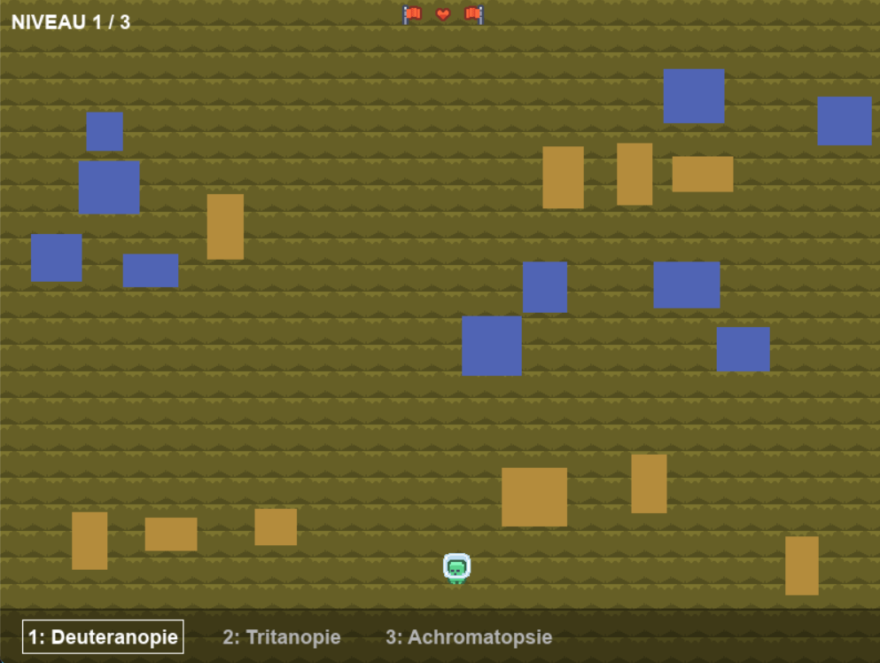
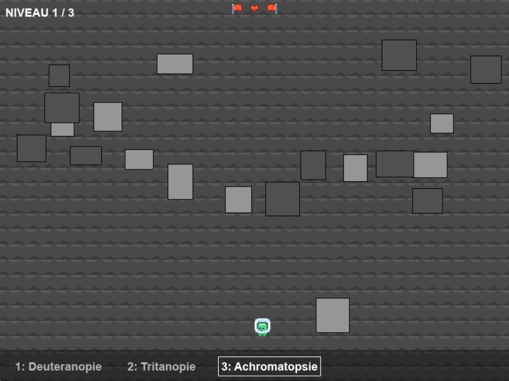

# BLIND WALK  
**« Voir l’invisible, survivre au handicap »**

> **SYSTEM STATUS:** COMPLETED  
> **PROJECT TYPE:** SERIOUS GAME / ACCESSIBILITY  
> **AUTHOR:** Wajdi Ben Ouirane (BUT3 Informatique)

---

## 1. Concept et objectifs

**Blind Walk** est un projet de *Serious Game* développé dans un objectif de **sensibilisation au handicap visuel**.  
Environ **300 millions de personnes** dans le monde vivent avec une vision altérée. Ce projet vise à transformer ce handicap en une **mécanique de jeu centrale, contraignante et punitive**.

Le joueur doit traverser un terrain rempli d’obstacles tout en souffrant de **cécité sélective** : il ne peut jamais percevoir la réalité dans son ensemble.  
Il doit constamment alterner entre différents filtres visuels afin de construire une **carte mentale du terrain** et survivre.

---

## 2. Mécaniques de jeu et filtres visuels

Le gameplay repose sur l’alternance obligatoire entre **trois modes de vision**, simulés à l’aide de **palettes colorimétriques scientifiques**.  
Chaque mode révèle certains dangers tout en en masquant d’autres.

| Touche | Mode visuel | Altération de la perception | Danger masqué (invisible) |
| :---: | :--- | :--- | :--- |
| **1** | **Deutéranopie** | Rouge / Vert confondus | Lave (rouge) |
| **2** | **Tritanopie** | Bleu / Jaune confondus | Eau (bleu) |
| **3** | **Achromatopsie** | Vision en niveaux de gris | Boue (orange) |

**Condition de défaite :**  
Si le joueur oublie de vérifier un filtre et entre en collision avec un obstacle invisible, la partie se termine immédiatement (*Game Over*).

---

## 3. Aperçu visuel

### Interface principale

### Simulation : mode Deutéranopie  
*Absence de distinction des obstacles rouges.*  

### Simulation : mode Tritanopie  
*Absence de distinction des obstacles bleus.*  

### Simulation : mode Achromatopsie  
*Vision basée uniquement sur la luminosité.*  

---

## 4. Installation et lancement

Ce projet nécessite **Python 3.10 ou supérieur**.

### Prérequis
- Python 3.x  
- Bibliothèque **Pygame**

### Procédure d’installation

Ouvrez un terminal dans le dossier racine du projet et exécutez :

    # 1. Installation des dépendances
    pip install -r requirements.txt

    # 2. Lancement du jeu
    python main.py

---

## 5. Architecture technique

Le projet est développé en **Python**, en suivant le paradigme de la **Programmation Orientée Objet (POO)**.

- **main.py** : Point d’entrée du programme. Gère l’initialisation du jeu et la boucle principale.
- **settings.py** : Contient les constantes globales ainsi que les dictionnaires de palettes colorimétriques (RGB).
- **classes/game.py** : Moteur du jeu (*Game Engine*). Gère la machine à états (**MENU**, **PLAYING**, **VICTORY**) ainsi que la logique de rendu.

### Logique de rendu (*Rendering Logic*)

Le système de cécité ne repose pas sur un simple filtre de post-traitement (*overlay*), mais sur un **rendu conditionnel strict**.

La méthode `draw()` interroge l’état du filtre actif.  
Si un filtre correspond à la couleur d’un obstacle (par exemple : **deutéranopie** et obstacle **rouge**), le moteur graphique **ne dessine pas l’objet**.

L’objet existe toujours physiquement dans le jeu : sa *hitbox* de collision reste active, mais il devient invisible pour le joueur, simulant ainsi une perte réelle d’information visuelle.

    # Extrait technique – logique de rendu conditionnel
    if self.current_filter != 0:
        # Si le mode Deutéranopie n'est PAS actif, on dessine les obstacles rouges.
        # Sinon, ils ne sont pas rendus à l'écran.
        for trap in self.traps_a:
            pygame.draw.rect(self.screen, color, trap.rect)

---

## 6. Auteur

**Wajdi Ben Ouirane**  
BUT3 Informatique — Parcours *Programmation Multimédia*  
Université Sorbonne Paris Nord — IUT de Villetaneuse
